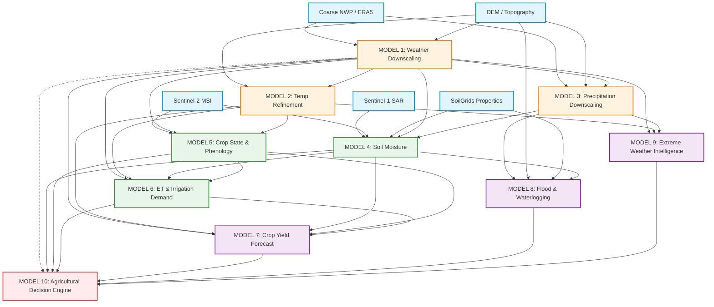

# 🌾 Kisaan Ki Yash — Master System Architecture Specification
### *Hyperlocal Climate Risk and Agricultural Decision Intelligence Platform*
**System Architectural Specification | Version:** `1.0.0-PROD` | **Status:** `ARCHITECTURE_LOCKED_PENDING_APPROVAL`

---

## 📑 Document Structure & Index

1. [Architectural Philosophy & Core Principles](#1-architectural-philosophy--core-principles)
2. [Complete Repository Architecture](#2-complete-repository-architecture)
3. [End-to-End Data Flow Architecture](#3-end-to-end-data-flow-architecture)
4. [The 10-Model ML Dependency Graph (DAG)](#4-the-10-model-ml-dependency-graph-dag)
5. [Input / Output Schemas for All 10 Models](#5-input--output-schemas-for-all-10-models)
6. [Training, Evaluation & Ground-Truth Validation Strategy](#6-training-evaluation--ground-truth-validation-strategy)
7. [Database Schema & Multi-Modal Storage Architecture](#7-database-schema--multi-modal-storage-architecture)
8. [Unified API Contract (FastAPI / OpenAPI Specifications)](#8-unified-api-contract-fastapi--openapi-specifications)
9. [Model Registry, Versioning & Artifact Lifecycle](#9-model-registry-versioning--artifact-lifecycle)
10. [Uncertainty, Calibration, OOD & Abstention Architecture](#10-uncertainty-calibration-ood--abstention-architecture)
11. [Panchayat Digital Twin State Engine](#11-panchayat-digital-twin-state-engine)
12. [Phased MVP Implementation Sequence](#12-phased-mvp-implementation-sequence)

---

## 1. Architectural Philosophy & Core Principles

The **Kisaan Ki Yash** platform operates on four non-negotiable engineering mandates:

1. **Resolution $\neq$ Accuracy**: Merely interpolating a 25-km numerical weather prediction (NWP) grid to 1-km does not generate information. True downscaling requires extracting high-frequency topographic, thermodynamic, and land-surface physics conditioned on independent ground-truth automated weather stations (AWS).
2. **Strict Decoupled Modularity**: Each of the 10 ML models operates behind a strict, typed interface. A model can be substituted (e.g., swapping an XGBoost baseline for a U-Net or Swin Transformer) with zero side-effects on downstream consumers.
3. **Uncertainty-First Decision Making**: No point predictions are consumed raw by decision logic. Every inference payload must carry certified confidence bounds (via Conformal Prediction), epistemic variance, and an explicit **Abstention Gate**. When epistemic drift exceeds safe operating bounds, the system automatically falls back to official IMD district advisories.
4. **Zero Hallucinated Data**: All features, coordinates, sensor records, and validation metrics must originate from verified sources (IMD AWS, ERA5-Land, Sentinel-1/2, SRTM DEM, SoilGrids, CCE reports).

---

## 2. Complete Repository Architecture

```
kisaankiyash/
├── .github/
│   └── workflows/              # CI/CD pipelines (lint, test, model schema validation)
├── configs/
│   ├── base_config.yaml        # Global project settings (CRS: EPSG:4326, 1km grid resolution: 0.009°)
│   ├── logging_config.yaml     # Structured JSON logging
│   └── models/                 # Model-specific hyperparameters (Model 1 to Model 10)
│       ├── model1_downscaling.yaml
│       ├── model2_temperature.yaml
│       ├── model3_precipitation.yaml
│       ├── model4_soil_moisture.yaml
│       ├── model5_crop_state.yaml
│       ├── model6_irrigation.yaml
│       ├── model7_yield.yaml
│       ├── model8_flood.yaml
│       ├── model9_extreme_weather.yaml
│       └── model10_decision.yaml
│
├── data/                       # Structured Data Lakehouse (Local / S3 / MinIO)
│   ├── raw/                    # Immutable incoming raw files
│   │   ├── nwp/                # GRIB2 / NetCDF (IMD GFS 12km, ECMWF 0.25°)
│   │   ├── satellite/          # Sentinel-1 GRD (SAFE), Sentinel-2 L2A (SAFE)
│   │   ├── dem/                # SRTM 30m / Copernicus DEM GeoTIFFs
│   │   ├── soil/               # SoilGrids 250m geotiffs (clay, sand, organic carbon)
│   │   ├── ground_stations/    # IMD AWS hourly CSVs, TDR soil moisture probe data
│   │   └── agricultural/       # CCE district yields, DAC&FW crop calendars
│   ├── processed/              # Aligned, reprojected, harmonized rasters
│   │   ├── terrain_features/   # 1-km aligned DEM, Slope, Aspect, TWI, Flow Accumulation
│   │   ├── satellite_cubes/    # Spatio-temporal Zarr cubes (VV, VH, NDVI, NDRE, LST)
│   │   └── aligned_weather/    # Regridded NWP inputs on target 1-km grid
│   └── training_splits/        # Deterministic, versioned train/val/test splits (Walk-forward)
│
├── src/
│   ├── core/                   # Shared system utilities
│   │   ├── constants.py        # Physical constants, EPSG codes, threshold limits
│   │   ├── exceptions.py       # Custom typed exceptions
│   │   ├── logger.py           # Structured telemetry
│   │   └── spatial.py          # GDAL / Rasterio / PyProj alignment and grid reprojection
│   │
│   ├── ingestion/              # Data Ingestion Layer
│   │   ├── imd_nwp_fetcher.py  # IMD GFS / NCMRWF automated downloaders
│   │   ├── copernicus_hub.py   # Sentinel-1/2 STAC API clients
│   │   └── ground_station_sync.py # AWS telemetry parser
│   │
│   ├── preprocessing/          # Data Quality & Geospatial Harmonization
│   │   ├── crs_aligner.py      # Standardizes to EPSG:4326 / UTM local zone
│   │   ├── missing_imputer.py  # Spatial spline / spatiotemporal kriging for missing data
│   │   ├── topographic.py      # Computes Slope, Aspect, Roughness, Topographic Wetness Index
│   │   └── temporal_resampler.py # Standardizes hourly, 3-hourly, daily cadences
│   │
│   ├── features/               # Feature Engineering & Storage
│   │   ├── feature_store.py    # Feast / Parquet-based low-latency feature retriever
│   │   ├── atmospheric.py      # Vapor Pressure Deficit (VPD), Dewpoint, GDD calculation
│   │   └── spectral_indices.py # NDVI, NDRE, EVI, NDWI, OPTRAM soil moisture proxy
│   │
│   ├── models/                 # The 10 Standalone ML Modules
│   │   ├── base_model.py       # Abstract Base Class enforcing interface
│   │   ├── model1_weather_downscaling/
│   │   │   ├── interface.py    # Pydantic Input/Output Schemas
│   │   │   ├── baseline.py     # Bilinear & Random Forest baseline
│   │   │   ├── trainer.py      # Training loop with validation callbacks
│   │   │   ├── evaluator.py    # Spatial & point metrics (MAE, RMSE, SSIM)
│   │   │   └── model.py        # Residual CNN / U-Net PyTorch architecture
│   │   ├── model2_temperature_refinement/
│   │   ├── model3_precipitation_downscaling/
│   │   ├── model4_soil_moisture/
│   │   ├── model5_crop_state/
│   │   ├── model6_irrigation_demand/
│   │   ├── model7_crop_yield/
│   │   ├── model8_flood_risk/
│   │   ├── model9_extreme_weather/
│   │   └── model10_decision_intelligence/
│   │
│   ├── uncertainty/            # Uncertainty, Calibration & Trust Framework
│   │   ├── conformal.py        # Conformalized Quantile Regression (CQR)
│   │   ├── calibration.py      # Temperature Scaling & Isotonic Calibration
│   │   ├── evidential.py       # Deep Evidential Regression loss & variance decomposition
│   │   ├── ood_detector.py     # Mahalanobis distance & feature reconstruction error
│   │   └── abstention_gate.py  # Binary decision: "Deploy Prediction" vs "Abstain to IMD"
│   │
│   ├── digital_twin/           # Panchayat Digital Twin Engine
│   │   ├── state_store.py      # In-memory / Redis cache of Panchayat multi-layer state
│   │   ├── simulator.py        # What-If Monte Carlo and hydrologic simulation runner
│   │   └── ontologies.py       # W3C SOSA/SSN semantic data mapping
│   │
│   └── api/                    # Serving & API Gateway
│       ├── app.py              # FastAPI application instance
│       ├── dependencies.py     # Model loader, Auth, DB session providers
│       ├── routers/
│       │   ├── weather.py      # 1-km downscaled endpoints
│       │   ├── agricultural.py # Soil, Crop, Irrigation endpoints
│       │   ├── hazard.py       # Flood, Extreme weather endpoints
│       │   └── digital_twin.py # Panchayat state & What-if simulation endpoints
│       └── schemas/            # Request/Response validation models
│
├── tests/                      # Automated Verification Test Suite
│   ├── unit/                   # Test mathematical routines (FAO-56, CQR, Topography)
│   ├── integration/            # Test data flow between models (Model 1 -> Model 6)
│   └── test_spatial_integrity.py # Verify no projection skew or coordinate shifts
│
├── artifacts/                  # Local Model Registry & Metrics Store
│   ├── registry.json           # Catalog of registered model weights & hashes
│   └── weights/                # Serialized ONNX / TorchScript / Booster models
│
├── docker/                     # Containerization
│   ├── Dockerfile.api          # Lightweight FastAPI serving container
│   ├── Dockerfile.worker       # Ingestion & continuous training worker
│   └── docker-compose.yml      # Local dev stack (PostGIS + Redis + MinIO + API)
│
├── MASTER_SYSTEM_ARCHITECTURE.md
├── README.md
└── requirements.txt
```

---

## 3. End-to-End Data Flow Architecture

The data pipeline guarantees strict spatial co-registration and temporal synchrony before any model receives a tensor.

```
[DATA INGESTION]
  ├─ IMD GFS / NCMRWF (GRIB2, ~12-25 km, 6-hourly)
  ├─ Sentinel-1 GRD (C-band SAR, 10m, 12-day repeat)
  ├─ Sentinel-2 L2A (13-band MSI, 10-20m, 5-day repeat)
  ├─ SRTM 30m DEM (Static GeoTIFF)
  ├─ SoilGrids 250m (Static GeoTIFF)
  └─ Ground Truth: IMD AWS Network (Hourly CSV / JSON telemetry)
         │
         ▼
[GEOSPATIAL HARMONIZATION & RESAMPLING]
  ├─ Coordinate Reference System (CRS) unification: All layers warped to EPSG:4326.
  ├─ Target Grid Definition: Uniform 0.0090° × 0.0090° (~1 km × 1 km over Indian latitudes).
  ├─ NWP Interpolation: Bilinear baseline to target grid for macro atmospheric variables.
  ├─ Static Auxiliary Extraction: Elevation, Slope (°), Aspect (rad), Topographic Wetness Index (TWI).
  └─ Quality Flags: Cloud masking (SCL band from Sentinel-2), SAR speckle filtering (Lee filter).
         │
         ▼
[FEATURE STORE / INGESTION BUS]
  ├─ Dynamic Tensor: Shape [B, C_dynamic, T, H, W] (Weather forecast steps, multi-temporal NDVI/SAR).
  └─ Static Tensor: Shape [B, C_static, H, W] (DEM, Slope, Aspect, Soil Clay %, Sand %).
         │
         ▼
[THE 10 ML MODELS PIPELINE (DAG)]
         │
         ▼
[UNCERTAINTY & ABSTENTION GATE]
  ├─ Compute empirical non-conformity score $E_i$ on calibration split.
  ├─ Generate certified lower and upper bounds $[q_{\alpha/2}, q_{1-\alpha/2}]$.
  ├─ Check OOD score: If Mahalanobis distance $D_M(x) > \tau_{\text{crit}}$, trigger ABSTENTION.
  └─ If Abstain: Return official district IMD advisory with caveat flag.
         │
         ▼
[PANCHAYAT DIGITAL TWIN STATE ENGINE]
  ├─ Updates Village Graph (Weather State, Soil State, Crop Stage, Hazard Index).
  └─ Exposes What-If Simulation API for local agriculture officers.
         │
         ▼
[DISPATCH & DELIVERY LAYER]
  ├─ Fastify / FastAPI Gateway
  ├─ Web GIS Dashboard (Leaflet / Mapbox Vector Tiles)
  └─ Vernacular Worker: Generates Hindi/Regional SMS, WhatsApp audio note, and IVR voice text.
```

---

## 4. The 10-Model ML Dependency Graph (DAG)

The system is strictly ordered to prevent cyclic dependencies. Upstream outputs are validated and calibrated before flowing into downstream modules:



---

## 5. Input / Output Schemas for All 10 Models

All models must serialize/deserialize via strict **Pydantic v2 schemas**.

### MODEL 1: Hyperlocal Weather Downscaling
- **Role**: Primary spatial super-resolution engine converting 25-km NWP fields to 1-km continuous grids.
- **Input Tensor**:
  - `coarse_weather`: $[B, 5, H_c, W_c]$ (Temperature, RelHumidity, SurfacePressure, U-Wind, V-Wind).
  - `terrain_static`: $[B, 4, H_f, W_f]$ (Elevation, Slope, Aspect, LandCover).
  - Grid Scaling: $H_f/H_c \approx 25$.
- **Output Schema**:
  ```python
  class WeatherDownscaledOutput(BaseModel):
      grid_id: str
      timestamp_utc: datetime
      resolution_km: float = Field(1.0, literal=True)
      temperature_c: float
      relative_humidity_pct: float = Field(ge=0.0, le=100.0)
      surface_pressure_hpa: float
      wind_speed_ms: float = Field(ge=0.0)
      wind_direction_deg: float = Field(ge=0.0, le=360.0)
      solar_radiation_wm2: float = Field(ge=0.0)
      confidence_score: float = Field(ge=0.0, le=1.0)
      epistemic_uncertainty: float
  ```

### MODEL 2: High-Resolution Temperature Refinement
- **Role**: Disaggregates downscaled temperatures into $T_{\max}, T_{\min}, T_{\text{mean}}$ using environmental lapse rates and diurnal thermodynamic heating.
- **Inputs**: Model 1 base temperature, Land Surface Temperature (MODIS/Sentinel-3 LST), Aspect, Elevation.
- **Output Schema**:
  ```python
  class TemperatureRefinedOutput(BaseModel):
      grid_id: str
      date: date
      t_mean_c: float
      t_max_c: float
      t_min_c: float
      diurnal_range_c: float
      lapse_rate_applied_c_per_km: float
      cqr_interval_90: tuple[float, float] # (lower_bound_90, upper_bound_90)
  ```

### MODEL 3: Precipitation Downscaling
- **Role**: Two-stage precipitation model solving the spatial drizzle problem.
- **Internal Stages**:
  1. Binary Classifier: $P(\text{Rain} > 0.1\text{ mm})$.
  2. Conditional Regressor: Amount $\mid (\text{Rain} > 0.1\text{ mm})$.
- **Output Schema**:
  ```python
  class PrecipitationDownscaledOutput(BaseModel):
      grid_id: str
      forecast_step_hours: int
      rain_probability: float = Field(ge=0.0, le=1.0)
      expected_rainfall_mm: float = Field(ge=0.0)
      lower_bound_90_mm: float = Field(ge=0.0)
      upper_bound_90_mm: float = Field(ge=0.0)
      intensity_category: Literal["NONE", "LIGHT", "MODERATE", "HEAVY", "VERY_HEAVY"]
      abstain_flag: bool = False
  ```

### MODEL 4: Soil Moisture Intelligence
- **Role**: Fuses Sentinel-1 C-band SAR backscatter with optical indices and soil properties to estimate volumetric water content.
- **Inputs**: $\sigma^\circ_{VV}, \sigma^\circ_{VH}$, NDVI, LST, Soil Clay %, Model 3 Rainfall history.
- **Output Schema**:
  ```python
  class SoilMoistureOutput(BaseModel):
      grid_id: str
      surface_sm_pct: float = Field(description="0-5 cm volumetric water content (%)", ge=0.0, le=100.0)
      root_zone_sm_pct: float = Field(description="5-40 cm estimated root zone moisture (%)", ge=0.0, le=100.0)
      field_capacity_pct: float
      wilting_point_pct: float
      water_stress_index: float = Field(description="0.0 = Saturated, 1.0 = Severe Drought", ge=0.0, le=1.0)
      sensor_source: Literal["SAR_OPTICAL_FUSION", "WATER_BALANCE_MODEL_FALLBACK"]
  ```

### MODEL 5: Crop State & Phenology
- **Role**: Tracks crop development stage, vegetative vigor, and anomalies using spectral time series and Growing Degree Days (GDD).
- **Inputs**: Sentinel-2 NDVI, NDRE, EVI time series, Accumulated GDD ($T_{\text{base}} = 10^\circ\text{C}$ for Kharif, $5^\circ\text{C}$ for Rabi), Sowing date.
- **Output Schema**:
  ```python
  class CropStateOutput(BaseModel):
      plot_or_grid_id: str
      crop_type: str
      sowing_date: date
      accumulated_gdd: float
      current_phenology_stage: Literal[
          "EMERGENCE", "VEGETATIVE", "FLOWERING_HEADING", "GRAIN_FILLING", "MATURITY", "HARVESTED"
      ]
      crop_coefficient_kc: float = Field(ge=0.2, le=1.35)
      chlorophyll_vigor_index: float = Field(ge=0.0, le=1.0)
      vegetation_health_anomaly_pct: float # Difference from 5-year historical NDVI
  ```

### MODEL 6: Evapotranspiration & Irrigation Demand
- **Role**: Computes physical FAO-56 Penman-Monteith $ET_0$, scales by $K_c$, and derives net irrigation requirements based on soil water depletion.
- **Inputs**: Model 1 (Temp, Humidity, Wind, Radiation), Model 5 ($K_c$), Model 4 (Current Soil Moisture), Model 3 (Forecast 24h Rain).
- **Output Schema**:
  ```python
  class IrrigationDemandOutput(BaseModel):
      grid_id: str
      reference_et0_mm_day: float = Field(ge=0.0)
      crop_etc_mm_day: float = Field(ge=0.0)
      depletion_fraction_p: float
      readily_available_water_mm: float
      irrigation_recommended: bool
      recommended_volume_mm: float
      action_urgency: Literal["NONE", "LOW", "MODERATE", "CRITICAL"]
      advisory_rationale: str
  ```

### MODEL 7: Crop Yield Forecasting
- **Role**: In-season yield prediction engine based on accumulated weather stress and satellite biomass proxies.
- **Inputs**: Cumulative GDD, seasonal water deficit, mid-season NDRE, soil organic carbon.
- **Output Schema**:
  ```python
  class CropYieldForecastOutput(BaseModel):
      crop_type: str
      panchayat_code: str
      expected_yield_ton_per_ha: float
      yield_lower_bound_90: float
      yield_upper_bound_90: float
      historical_panchayat_benchmark_ton_per_ha: float
      projected_yield_anomaly_pct: float
      prediction_confidence_pct: float
  ```

### MODEL 8: Flood & Waterlogging Risk
- **Role**: Predicts rapid-onset waterlogging and catchment runoff based on downscaled rainfall, flow accumulation, and Topographic Wetness Index.
- **Inputs**: Model 3 (1-hr & 24-hr rainfall volume and peak intensity), SRTM Flow Accumulation, TWI, Land use.
- **Output Schema**:
  ```python
  class FloodRiskOutput(BaseModel):
      panchayat_code: str
      lead_time_hours: int
      inundation_probability: float = Field(ge=0.0, le=1.0)
      risk_level: Literal["LOW", "MODERATE", "HIGH", "EXTREME"]
      vulnerable_area_ha: float
      waterlogging_drainage_time_hours: float
      protective_actions: list[str]
  ```

### MODEL 9: Extreme Weather & Hazard Intelligence
- **Role**: Detects climatological anomalies (heatwaves, coldwaves, cloudbursts, dry spells) using localized historical percentile distributions.
- **Inputs**: Model 1, Model 2, Model 3, 30-year IMD climatological percentiles ($P_{90}, P_{95}, P_{99}$).
- **Output Schema**:
  ```python
  class ExtremeWeatherOutput(BaseModel):
      panchayat_code: str
      hazard_type: Literal["HEATWAVE", "COLD_WAVE", "CLOUDBURST", "GALE_WIND", "DRY_SPELL", "NONE"]
      historical_percentile: float = Field(ge=0.0, le=100.0)
      severity_alert: Literal["GREEN", "YELLOW", "ORANGE", "RED"]
      duration_hours: int
      impact_summary: str
  ```

### MODEL 10: Agricultural Decision Intelligence Engine
- **Role**: Top-level multi-criteria optimization engine synthesizing models 1–9 into concrete, actionable, vernacular farmer decisions.
- **Inputs**: Outputs from Models 1 through 9.
- **Output Schema**:
  ```python
  class DecisionActionItem(BaseModel):
      category: Literal["IRRIGATION", "SPRAYING", "FERTILIZATION", "SOWING", "HARVESTING", "HAZARD_DEFENSE"]
      status: Literal["RECOMMENDED", "PROHIBITED", "CONDITIONAL", "STANDBY"]
      priority: Literal["INFO", "WARNING", "URGENT"]
      vernacular_message_hi: str
      vernacular_message_en: str
      scientific_justification: str

  class MasterDecisionAdvisory(BaseModel):
      panchayat_code: str
      issued_at: datetime
      valid_until: datetime
      actions: list[DecisionActionItem]
      governing_uncertainty_level: Literal["LOW", "ACCEPTABLE", "HIGH_PROCEED_WITH_CAUTION", "ABSTAIN_TO_IMD"]
  ```

---

## 6. Training, Evaluation & Ground-Truth Validation Strategy

### Non-Negotiable Validation Protocol:
To eliminate spatial data leakage and deceptive accuracy:
1. **Spatial Splitting**: Models are trained on Cluster A Panchayats and tested on geographically isolated Cluster B Panchayats (Leave-One-Panchayat-Out / Leave-One-District-Out).
2. **Temporal Splitting**: Strict Walk-Forward (Expanding Window) validation. Never use future dates to predict past observations.
3. **Independent Ground Truth Grounding**:
   - Weather downscaling is **never** evaluated against the coarse input NWP. Evaluation is exclusively conducted against physically independent **IMD Automatic Weather Station (AWS)** telemetry points.
   - Soil moisture is validated against in-situ Time-Domain Reflectometry (TDR) probe networks.
   - Yield is validated against district Crop Cutting Experiment (CCE) records.

### Comprehensive Metric Suite:

| Task Type | Core Metrics | Formula / Definition | Target Minimum Skill |
|---|---|---|---|
| **Continuous Weather** | MAE, RMSE, $R^2$, SSIM | $\text{RMSE} = \sqrt{\frac{1}{N}\sum(y_i - \hat{y}_i)^2}$ | $T_{\text{MAE}} < 1.2^\circ\text{C}$, $R^2 > 0.85$ |
| **Rainfall Detection** | Critical Success Index (CSI), POD, FAR | $\text{CSI} = \frac{\text{Hits}}{\text{Hits} + \text{Misses} + \text{FalseAlarms}}$ | $\text{CSI} > 0.45$ for rain $> 5\text{ mm}$ |
| **Probabilistic Skill** | Continuous Ranked Probability Score (CRPS) | $\text{CRPS}(F, y) = \int_{-\infty}^\infty (F(z) - \mathbb{I}(z \ge y))^2 dz$ | Outperforms climatology by $> 25\%$ |
| **Uncertainty Bounds** | Prediction Interval Coverage Probability (PICP) | $\text{PICP} = \frac{1}{N} \sum_{i=1}^N \mathbb{I}(y_i \in [\hat{L}_i, \hat{U}_i])$ | $\text{PICP} \ge 0.90$ for $\alpha = 0.10$ |
| **Interval Width** | Mean Prediction Interval Width (MPIW) | $\text{MPIW} = \frac{1}{N}\sum_{i=1}^N (\hat{U}_i - \hat{L}_i)$ | Minimize while satisfying PICP |

---

## 7. Database Schema & Multi-Modal Storage Architecture

### Multi-Tier Storage Topology:
1. **TimescaleDB / PostGIS**: Relational geospatial vector data, administrative boundaries, ground sensor time-series, and generated advisories.
2. **Zarr Cubes (Object Store / S3)**: N-dimensional compressed arrays for gridded 1-km weather outputs, radar nowcasts, and multi-spectral satellite rasters.
3. **Redis**: Ultra-low-latency in-memory cache for live Panchayat Digital Twin state representations.

### PostGIS DDL Schema:

```sql
-- Enable PostGIS and TimescaleDB extensions
CREATE EXTENSION IF NOT EXISTS postgis;
CREATE EXTENSION IF NOT EXISTS timescaledb;

-- Administrative Boundaries (Panchayat / Block / District)
CREATE TABLE panchayats (
    panchayat_code VARCHAR(32) PRIMARY KEY,
    name VARCHAR(128) NOT NULL,
    block_name VARCHAR(128) NOT NULL,
    district_name VARCHAR(128) NOT NULL,
    state_name VARCHAR(128) NOT NULL,
    centroid GEOMETRY(Point, 4326) NOT NULL,
    boundary GEOMETRY(MultiPolygon, 4326) NOT NULL
);
CREATE INDEX idx_panchayats_geom ON panchayats USING GIST(boundary);

-- Ground Automated Weather Stations (IMD / Private IoT)
CREATE TABLE ground_weather_stations (
    station_id VARCHAR(32) PRIMARY KEY,
    station_name VARCHAR(128),
    elevation_m REAL,
    location GEOMETRY(Point, 4326) NOT NULL,
    is_active BOOLEAN DEFAULT TRUE
);

-- Ground Station Observations (Hypertable)
CREATE TABLE ground_station_observations (
    recorded_at TIMESTAMPTZ NOT NULL,
    station_id VARCHAR(32) REFERENCES ground_weather_stations(station_id),
    temperature_c REAL,
    relative_humidity_pct REAL,
    rainfall_1h_mm REAL,
    wind_speed_ms REAL,
    solar_radiation_wm2 REAL
);
SELECT create_hypertable('ground_station_observations', 'recorded_at');

-- Panchayat Digital Twin State Table (Hypertable)
CREATE TABLE panchayat_digital_twin_states (
    state_timestamp TIMESTAMPTZ NOT NULL,
    panchayat_code VARCHAR(32) REFERENCES panchayats(panchayat_code),
    avg_temperature_c REAL NOT NULL,
    avg_soil_moisture_pct REAL NOT NULL,
    dominant_crop VARCHAR(64),
    crop_stage VARCHAR(64),
    daily_et0_mm REAL,
    flood_risk_level VARCHAR(16) DEFAULT 'LOW',
    heat_risk_level VARCHAR(16) DEFAULT 'GREEN',
    active_advisory_id UUID
);
SELECT create_hypertable('panchayat_digital_twin_states', 'state_timestamp');

-- Decision Advisories Log
CREATE TABLE decision_advisories (
    advisory_id UUID PRIMARY KEY DEFAULT gen_random_uuid(),
    panchayat_code VARCHAR(32) REFERENCES panchayats(panchayat_code),
    created_at TIMESTAMPTZ NOT NULL,
    valid_until TIMESTAMPTZ NOT NULL,
    irrigation_action VARCHAR(32),
    spraying_action VARCHAR(32),
    hazard_warning VARCHAR(32),
    hindi_message TEXT NOT NULL,
    english_message TEXT NOT NULL,
    governing_confidence_score REAL NOT NULL,
    abstained_to_imd BOOLEAN DEFAULT FALSE
);
CREATE INDEX idx_advisories_panchayat_time ON decision_advisories(panchayat_code, created_at DESC);
```

---

## 8. Unified API Contract (FastAPI / OpenAPI Specifications)

Every model and workflow is served via standard REST endpoints adhering to the OpenAPI 3.1 specification.

### Key Endpoints:

#### `GET /api/v1/weather/downscaled`
Retrieve 1-km downscaled weather forecast for a coordinate or Panchayat.
- **Parameters**: `lat: float`, `lon: float`, `forecast_horizon_hours: int = 24`
- **Response**:
  ```json
  {
    "location": {"lat": 26.8467, "lon": 80.9462},
    "grid_id": "IND_UP_1KM_54821",
    "forecast": [
      {
        "timestamp_utc": "2026-09-27T00:00:00Z",
        "temperature": {"prediction": 28.4, "lower_90": 26.9, "upper_90": 29.8, "unit": "C"},
        "rainfall": {"prediction_mm": 12.4, "rain_probability": 0.88, "lower_90": 8.0, "upper_90": 17.5},
        "humidity_pct": 82.0,
        "wind_speed_ms": 3.4,
        "confidence_score": 0.91,
        "abstain": false
      }
    ]
  }
  ```

#### `GET /api/v1/advisory/panchayat/{panchayat_code}`
Retrieve latest agricultural decision advisory for a Panchayat.
- **Response**:
  ```json
  {
    "panchayat_code": "0924001001",
    "panchayat_name": "Bakshi Ka Talab",
    "timestamp": "2026-09-26T20:00:00Z",
    "recommendations": {
      "irrigation": {
        "action": "DO_NOT_IRRIGATE",
        "urgency": "INFO",
        "reason_hi": "अगले 24 घंटों में 12.4 मिमी बारिश की 88% संभावना है और मिट्टी में नमी पर्याप्त है।",
        "reason_en": "88% probability of 12.4 mm rainfall in next 24 hours. Soil moisture adequate."
      },
      "spraying": {
        "action": "PROHIBITED",
        "urgency": "WARNING",
        "reason_hi": "बारिश और तेज हवाओं के कारण कीटनाशक का छिड़काव न करें, दवा धुल जाएगी।",
        "reason_en": "Do not spray pesticides due to high probability of wash-off by rain."
      }
    },
    "governing_uncertainty": "ACCEPTABLE"
  }
  ```

#### `POST /api/v1/digital-twin/simulate`
Run What-If scenarios on the Panchayat digital twin.
- **Request**:
  ```json
  {
    "panchayat_code": "0924001001",
    "scenario": {
      "precipitation_perturbation_mm": 50.0,
      "canal_water_release_days": 0
    }
  }
  ```
- **Response**: Returns predicted waterlogging area (hectares), soil saturation percentage, and risk escalation map.

---

## 9. Model Registry, Versioning & Artifact Lifecycle

Every model artifact is tracked systematically:
- **Registry Schema (`artifacts/registry.json`)**:
  ```json
  {
    "model_id": "model3_precipitation",
    "version": "1.2.0",
    "framework": "PyTorch",
    "file_hash_sha256": "e3b0c44298fc1c149afbf4c8996fb92427ae41e4649b934ca495991b7852b855",
    "training_date": "2026-09-20",
    "training_dataset_hash": "ds_monsoon_v2_2026",
    "metrics": {
      "csi_gt_5mm": 0.52,
      "crps": 1.42,
      "picp_90": 0.912
    },
    "calibration_parameters": {
      "temperature_scaling_factor": 1.14,
      "conformal_quantile_lambda": 1.84
    },
    "status": "PRODUCTION"
  }
  ```
- **Deployment Policy**: A newly trained model will only be promoted to `PRODUCTION` if its independent validation CRPS and CSI outperform the existing active version on the benchmark test set.

---

## 10. Uncertainty, Calibration, OOD & Abstention Architecture

The core differentiator between a prototype weather app and an enterprise-grade agricultural decision system:

```
[MODEL RAW INFERENCE]
         │
         ▼
[CALIBRATION LAYER]
  ├─ Classification Outputs (Rain/No-Rain): Temperature Scaling: $\hat{p} = \sigma(z / T)$
  └─ Regression Quantiles (Rainfall/Temp): Pinball loss optimization
         │
         ▼
[CONFORMALIZED QUANTILE REGRESSION (CQR)]
  ├─ Computes non-conformity residuals on separate validation holdout:
  │    $E_i = \max(\hat{q}_{\alpha/2}(x_i) - y_i, y_i - \hat{q}_{1-\alpha/2}(x_i))$
  ├─ Conformal Quantile: $\hat{Q} = \text{Quantile}_{1-\alpha}(E_1, \dots, E_n)$
  └─ Guaranteed Finite-Sample Interval: $[\hat{q}_{\alpha/2}(x) - \hat{Q}, \hat{q}_{1-\alpha/2}(x) + \hat{Q}]$
         │
         ▼
[OUT-OF-DISTRIBUTION (OOD) DETECTOR]
  ├─ Computes Mahalanobis distance $D_M(x) = \sqrt{(x - \mu)^T \Sigma^{-1} (x - \mu)}$ on feature embedding.
  └─ Evaluates feature reconstruction error via variational bottleneck.
         │
         ▼
[ABSTENTION GATE]
  ├─ Check 1: Is $D_M(x) > \tau_{\text{OOD}}$?
  ├─ Check 2: Is normalized interval width $\frac{\hat{U} - \hat{L}}{\hat{y}} > \tau_{\text{uncertainty}}$?
  │
  ├─ If YES to either ➔ TRIGGER ABSTENTION:
  │    • Status: "HIGH_ATMOSPHERIC_VOLATILITY"
  │    • Action: Fall back to official IMD district forecast
  │    • Advisory: Issue cautionary warning rather than specific action
  │
  └─ If NO ➔ PASS TO DECISION ENGINE WITH CERTIFIED BOUNDS
```

---

## 11. Panchayat Digital Twin State Engine

The Panchayat Digital Twin maintains a continuous, live cyber-physical state of every Panchayat:
- **Node Topology**: Each Panchayat is modeled as a connected graph of micro-watersheds and agricultural land parcels.
- **Continuous State Vector**:
  $$S(t) = \Big\{ \mathbf{W}_{\text{1km}}(t), \; \mathbf{\Theta}_{\text{soil}}(t), \; \mathbf{\Phi}_{\text{crop}}(t), \; \mathbf{H}_{\text{hazard}}(t), \; \mathbf{Q}_{\text{water}}(t) \Big\}$$
  - $\mathbf{W}_{\text{1km}}$: 1-km downscaled meteorological tensor.
  - $\mathbf{\Theta}_{\text{soil}}$: Multi-depth soil moisture and salinity field.
  - $\mathbf{\Phi}_{\text{crop}}$: Phenology stage, NDVI, and crop coefficient vector.
  - $\mathbf{H}_{\text{hazard}}$: Continuous risk indices (flood, heat, pest vulnerability).
  - $\mathbf{Q}_{\text{water}}$: Canal distribution schedule and groundwater depletion rate.
- **What-If Simulation Capability**: Allows officers to alter rainfall or irrigation inputs and observe simulated changes in soil moisture and crop water stress across the Panchayat.

---

## 12. Phased MVP Implementation Sequence

We build progressively. No model is built in isolation without its upstream dependencies and baseline verification:

```
[PHASE 1: Core Weather Foundation & Downscaling] ◄── CURRENT FOCUS
  ├── 1.1 Ingestion & Geospatial Harmonization Pipeline (IMD GFS + SRTM DEM + PostGIS)
  ├── 1.2 MODEL 1 (Hyperlocal Weather Downscaling: Baseline RF/Interpolation ➔ Residual CNN)
  ├── 1.3 MODEL 3 (Precipitation Downscaling: 2-stage Classifier + Amount Regressor)
  ├── 1.4 Uncertainty Engine (Conformalized Quantile Regression + Abstention Gate)
  └── 1.5 1-km Interactive Map & Core Ingestion Worker

[PHASE 2: Soil Moisture, Phenology & Water Intelligence]
  ├── 2.1 Sentinel-1 SAR & Sentinel-2 Optical ingestion pipeline
  ├── 2.2 MODEL 4 (Soil Moisture Retrieval: SAR + Optical + SoilGrids)
  ├── 2.3 MODEL 2 (High-Resolution Temperature Refinement: Lapse rate + LST)
  ├── 2.4 MODEL 5 (Crop State & Phenology Tracking: GDD + NDVI time-series)
  └── 2.5 MODEL 6 (FAO-56 Penman-Monteith ET₀ & Irrigation Demand Engine)

[PHASE 3: Yield, Hazards & Disaster Risk Intelligence]
  ├── 3.1 MODEL 8 (Flood & Waterlogging Inundation Model using TWI & Flow Accumulation)
  ├── 3.2 MODEL 9 (Extreme Weather Hazard Intelligence & Climatological Percentiles)
  └── 3.3 MODEL 7 (In-Season Crop Yield Forecasting)

[PHASE 4: Digital Twin, Decision Engine & Vernacular Delivery]
  ├── 4.1 MODEL 10 (Agricultural Decision Intelligence Engine & Multi-Criteria Rules)
  ├── 4.2 Panchayat Digital Twin State Engine & What-If Simulation Runner
  └── 4.3 Vernacular Delivery: Automated Hindi SMS, WhatsApp audio advisory, and Web UI
```

---
*Authored & Validated for Kisaan Ki Yash — SIH System Architecture.*
